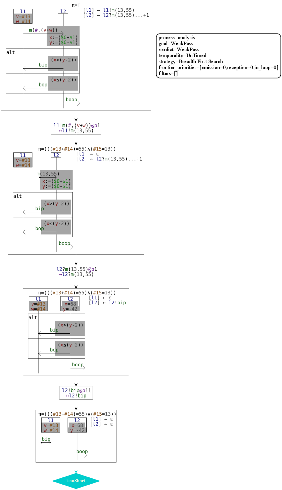

# HIBOU EFM

HIBOU (for Holistic Interaction Behavioral Oracle Utility) provides utilities for the analysis of traces and 
multi-traces collected from the execution of Distributed Systems against interaction models.

This present version "hibou_efm" treats interaction models enriched with data and time via the use of a
third party software : [Diversity](https://projects.eclipse.org/projects/modeling.efm) (by the [CEA](http://www.cea.fr/)) 
which acts as a symbolic execution engine.

"hibou_efm" is an extension to data and time of "[hibou_label](https://github.com/erwanM974/hibou_label)". 
We invite you to familiarize yourself with "[hibou_label](https://github.com/erwanM974/hibou_label)" before going any further
with "hibou_efm".

This piece of software has been developed as part of my PhD thesis in 2018-2020 at the 
[CentraleSupelec](https://www.centralesupelec.fr/)
engineering school
(part of Université Paris-Saclay) 
in collaboration with the 
[CEA](http://www.cea.fr/) (Commissariat à l'énergie atomique et aux énergies alternatives).

# Principle

# Refining the execution of interaction models with symbolic execution

With those enriched models, we can refine the processes of interaction execution originally used for labelled interaction models.

## Example 1 : Multi-Trace analysis with PASS verdict

## Example 2 : Multi-Trace analysis with FAIL verdict

 
## Example 3 : The scope operator to express variable scoping

