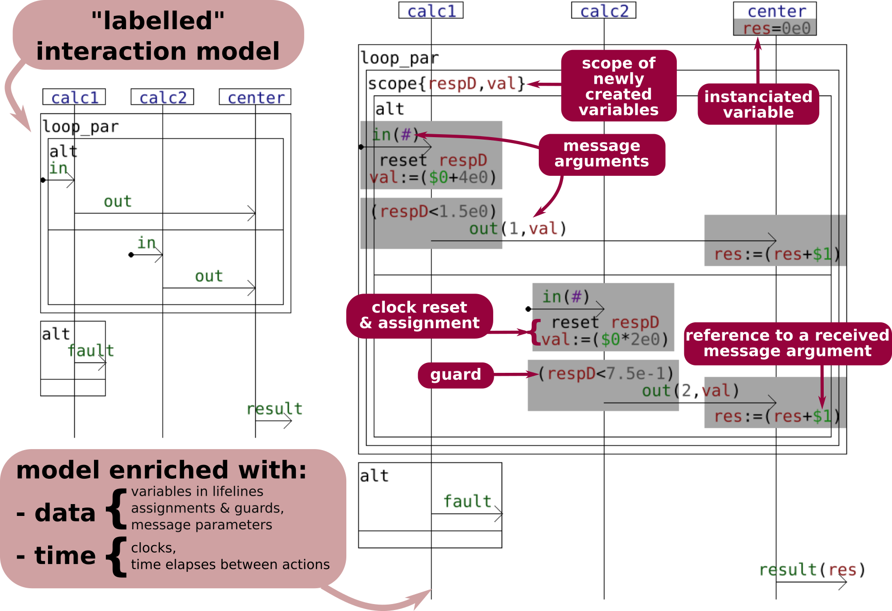
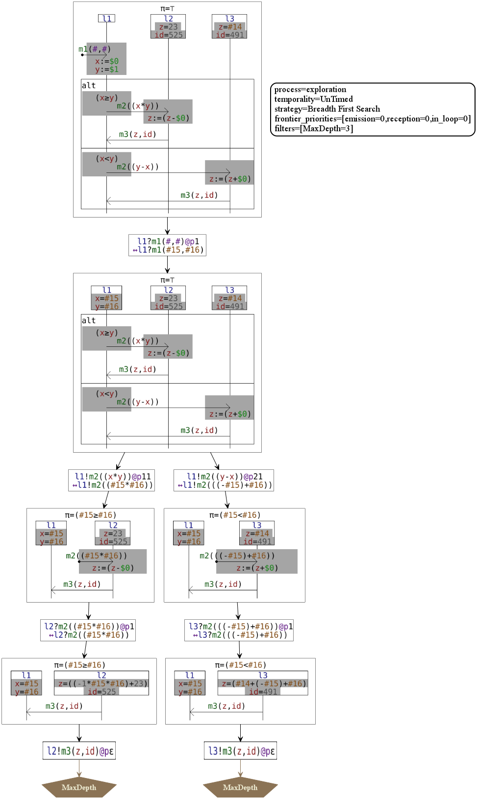
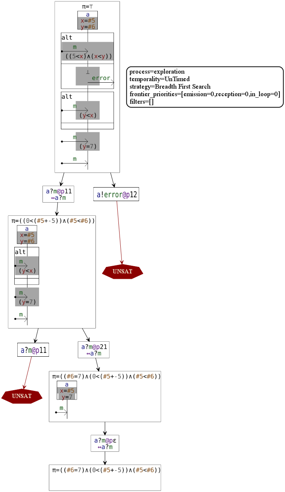
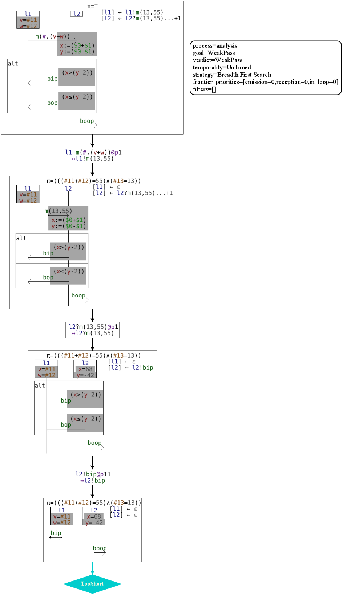
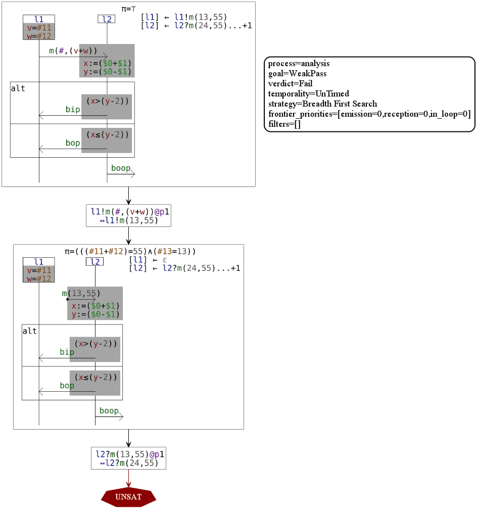
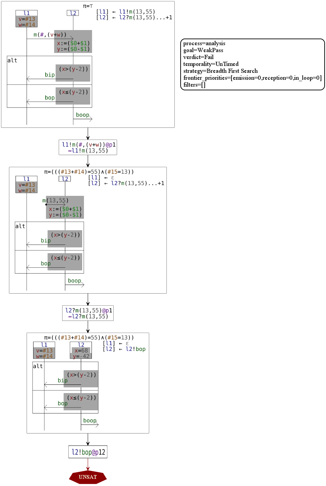
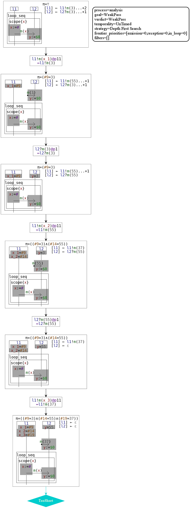

# HIBOU EFM

HIBOU (for Holistic Interaction Behavioral Oracle Utility) provides utilities for the analysis of traces and 
multi-traces collected from the execution of Distributed Systems against interaction models.

This present version "hibou_efm" treats interaction models enriched with data and time via the use of a
third party software : [Diversity](https://projects.eclipse.org/projects/modeling.efm) (by the [CEA](http://www.cea.fr/)) 
which acts as a symbolic execution engine.

"hibou_efm" is an extension to data and time of "[hibou_label](https://github.com/erwanM974/hibou_label)". 
We invite you to familiarize yourself with "[hibou_label](https://github.com/erwanM974/hibou_label)" before going any further
with "hibou_efm".

This piece of software has been developed as part of my PhD thesis in 2018-2020 at the 
[CentraleSupelec](https://www.centralesupelec.fr/)
engineering school
(part of Université Paris-Saclay) 
in collaboration with the 
[CEA](http://www.cea.fr/) (Commissariat à l'énergie atomique et aux énergies alternatives).


# Principle

In short, we extend the functionalities of [hibou_label](https://github.com/erwanM974/hibou_label) to interaction models
that contain data and time. Those enriched models involve (informally):
- "variables" that can be owned by specific lifelines and which values may vary during the execution of the interaction model
- "message parameters" i.e. the messages which are exchanged between lifelines are not simple labels anymore but instead they can
  carry some values which can be computed on the fly (at the moment of the emission) and transmitted between lifelines
- "assignments" which are basic operations that can accompany the observation of an event within the interaction model (emission or reception)
  and modify the value of a given "variable". This variable can be already owned by the lifeline on which the assignment occurs, and in this
  case, its value is simply modified. And if the variable did not exist, it is created when evaluating the assignment. The value that
  is assigned to a variable by an assignment is computed from a term that can be be constructed from raw values, typed operators, 
  variables and so on.
- "guards", which are boolean conditions on the expression of a certain event (emission or reception). Those boolean expressions can
  constrain the variables (their current values) of the lifeline on which the event occurs.
- "clocks", which are a specific kind of variables, which values change when time elapses (without needing assignments).

The diagram below illustrates how one can use those new tools so as to refine a "labelled" interaction model (on the left, without data 
and time), into a "symbolic" interaction model (on the right, with data and time).

Here, when lifeline "calc1" receives the message "in", it also received a value (an integer which value is unspecified - # symbol -) which was not the case
in the model on the left. In addition to that, once the reception event occurs, lifeline "calc1" resets its clock "respD" (i.e.
set it to zero), creates a new variable "val" (a new one for each iteration of the loop, thanks to the "scope" operator)
and assign to it a value which is that of the received value (0th argument of the "in" message) plus 4.

Also, in the enriched model, the subsequent emission of the "out" message by "calc1" must satisfies the guard "respD < 1.5". Given that
this clock has been reset when evaluating the reception of "in", this means that the guard specifies a minimum response time
for "calc1". Once receiving "in", it must emit "out" within 1.5 seconds. In addition, the emitted "out" message is parameterized
with 2 arguments, one of whioh corresponds to the current value (at the moment of the emission) of the "val" variable on lifeline
"calc1".



To sum up, this extension to data and time allows finer specifications of the expected behaviors for distributed systems modelled
by interactions. Message parameters constitute a direct refinement of abstract message labels and allow the verification of
concrete inputs and outputs when analysing (multi-)traces. Guards may constrain which events can be taken at any moment 
(they must be satisfiable at the moment of the execution of said event, given the current values of variables). As a result,
the use of guards refine which paths can be taken when exploring the execution tree of a given interaction model.

In the following, we provide some explanations via the description of some concrete examples. 

# Refining the execution of interaction models with symbolic execution

With those enriched models, we can refine the processes of interaction execution originally used for labelled interaction models.


## Example 1 : Model Exploration with symbolic execution

When launching "hibou explore example_1.hsf" on the "example_1.hsf" file which content is given below (and can be found in the "examples" folder)
we get the following exploration tree.

```
@explore_option{
    loggers = [graphic=svg];
    pre_filters = [ max_depth = 3 ]
}
@message{
    m1(Integer,Integer);
    m2(Integer);
    m3(Integer,Integer)
}
@variable{
    x : Integer;
    y : Integer;
    z : Integer;
    id : Integer
}
@lifeline{
    l1;l2;l3
}
@init{
    l2.id = 525;
    l2.z = 23;
    l3.id = 491;
    l3.z = #
}
@seq(
    m1(#,#) -> l1{x:=$0;y:=$1},
    @alt(
        @seq(
            [(x>=y)]l1 -- m2((x*y)) -> l2{z:=(z-$0)},
            l2 -- m3(z,id) -> l1
        ),
        @seq(
            [(x<y)]l1 -- m2((y-x)) -> l3{z:=(z+$0)},
            l3 -- m3(z,id) -> l1
        )
    )
)
```

We can see here that, initially, lifeline "l2" has 2 variables : "z" which value is 23 and "id" which value is 525. Lifeline "l3"
has also two variables of the same names (but those are not the same variables given that they belong to different lifelines) but
with different values. Let us notice that "l3.z" (the variable "z" of lifeline "l3") has an unknown value, which corresponds to the
symbol (as in symbolic execution) #14.

When executing the reception of "m1" by "l1", 2 new unknown (symbols #15 and #16) are added to the problem and assigned to variables
"l1.x" and "l1.y".

In the following alternative, two choices are possible, but constrained by guards. In the first (on the left in the exploration tree)
we must have (at the moment of the evaluation of the guard) "l1.x >= l1.y" which translates into "#15 >= #16" given the current
interpretation of variables. In the next step, let us note that the path condition (the set of constraints on symbols that must be satisfiable)
noted with the greek letter "π" has been updated accordingly.



## Example 2 : Exploration of model with contradictions (unsatisfiable path conditions)

Of course, with the addition of boolean expressions as guards, it may happen that those guards cannot be satisfied.
In the following example we illustrate this.

When launching "hibou explore example_2.hsf" on the "example_2.hsf" file which content is given below (and can be found in the "examples" folder)
we get the following exploration tree.

```
@explore_option{
    loggers = [graphic=svg]
}
@message{
    m;
    out (Integer, Integer);
    error
}
@variable{
    x : Integer;
    y : Integer
}
@lifeline{
    a
}
@init{
    a.x = #;
    a.y = #
}
@seq(
    @alt(
        m -> a[((5<x)/\(x<y))],
        [⊥]a -- error ->|
    ),
    @alt(
        m ->a[(y<x)],
        o
    ),
    m -> a[(y=7)],
    m -> a
)
```

In the first alternative, we have two possibilities. Either lifeline "a" receives "m", or it emits "error". In the second case,
we have a guard that has "⊥" for boolean expression. This guard is never satisfiable. As a result, when exploring the model (see below),
we get an UNSAT. Let us remark that using "⊥" guards in this fashion can be used to model undesirable behaviors.

In the left branch of the alternative, we add a constraint on the variables "x" and "y" of "a". This constraint it evaluated
and incorporated into the path condition "π" at the next step. With "π" becoming "(#5 > 5)/\(#5 < #6)".

However, at the next step, we have another alternative, where, in one of the branch, satisfying another guard is required. 
This guard would translate (given the current values of variables) into "#6<#5", which is not compatible with our path condition "π".
Therefore, we have another UNSAT.



## Example 3-1 : Multi-Trace analysis with PASS verdict

As in [hibou_label](https://github.com/erwanM974/hibou_label), in hibou_efm, we can also analyse traces and multi-traces w.r.t. interaction models.
One of the notable improvement in this regards, is that we can now analyse traces which contains concrete data in the form of message parameters.

Let us consider the following example:

We have the following .hsf model file:

```
@analyze_option{
    loggers = [graphic=svg];
    goal = WeakPass
}
@message{
    m(Integer,Integer);
    bip;bop;boop
}
@variable{
    x : Integer;
    y : Integer;
    v : Integer;
    w : Integer
}
@lifeline{
    l1;
    l2
}
@init{
    l1.v = #;
    l1.w = #
}
@seq(
    l1 -- m(#,(v+w)) -> l2{x:=($0+$1);y:=($0-$1)},
    @alt(
        [(x>(y-2))]l2 -- bip -> l1,
        [(x<=(y-2))]l2 -- bop -> l1
    ),
    l2 -- boop ->|
)
```

And we analyse a multi-trace specified by the following .htf file (in "examples" folder). Let us remark the notation
for specifying concrete message parameters.

```
{
    [l1] l1!m(13,55);
    [l2] l2?m(13,55).l2!bip
}
```

When we launch the analysis, we get a WeakPass verdict (it is a prefix of an accepted multi-trace) as illustrated below.
Let us note that the concrete values of the message parameters in the input trace that is analysed are passed onto the path condition
during the analysis.
For instance, in the first step of the analysis, we consume the action "l1!m(13,55)" from the trace.
On the side of the model, the only action that may match is the "l1!m(#,(v+w))", where # corresponds to a new unknown of the problem
(a fresh symbol in symbolic execution) and "(v+w)" is a term cosntructed from "l1.v" and "l1.w" (given that the action occurs on "l1).
As a result, the consumption of this action from the trace implies that it must match the symbolic action.
Given that current value of "l1.v" is the symbol #11 and that of "l1.w" is #12, this means that we must have "(#11+#12)=55"
(second message parameter).
Also, when we execute the symbolic action, a new symbol #13 is created, and it must be so that #13=13 
(first message parameter).
As a result, we add "((#11+#12)=55)/\(#13=13))" to the path condition.



## Example 3.2 : Multi-Trace analysis with FAIL verdict due to wrong message parameters (e.g. man-in-the-middle attack)

Let us now consider the analysis of a different multi-trace w.r.t. the same interaction model. We consider the multi-trace given below.
Let us remark, that the message "m" transmitted from "l1" to "l2" has been tempered with during the transmission (for instance,
this could be interpreted as a man-in-the-middle attack; the integrity of the transmitted data being jeopardized).

```
{
    [l1] l1!m(13,55);
    [l2] l2?m(24,55).l2!bip
}
```

During the analysis, given that the expected reception event is rewritten into the model in the second step, we know that (13,55) are
expected to be received by "l2". As a result, we get an UNSAT when trying to evaluate the reception 
of "m" with (24,55) as message parameters.


 
 ## Example 3.2 : Multi-Trace analysis with FAIL verdict due to path condition unsatisfiability
 
 
 
## Example 4 : The scope operator to express variable scoping


